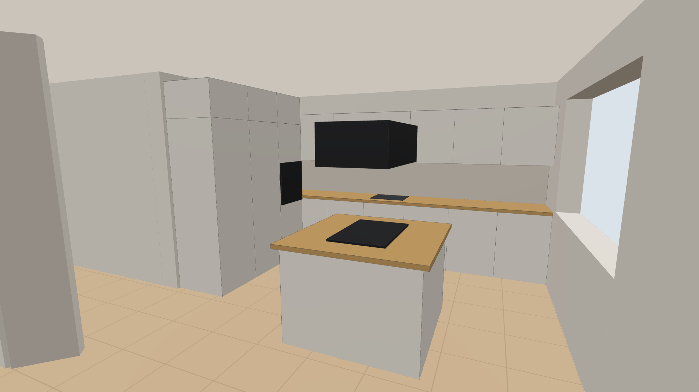
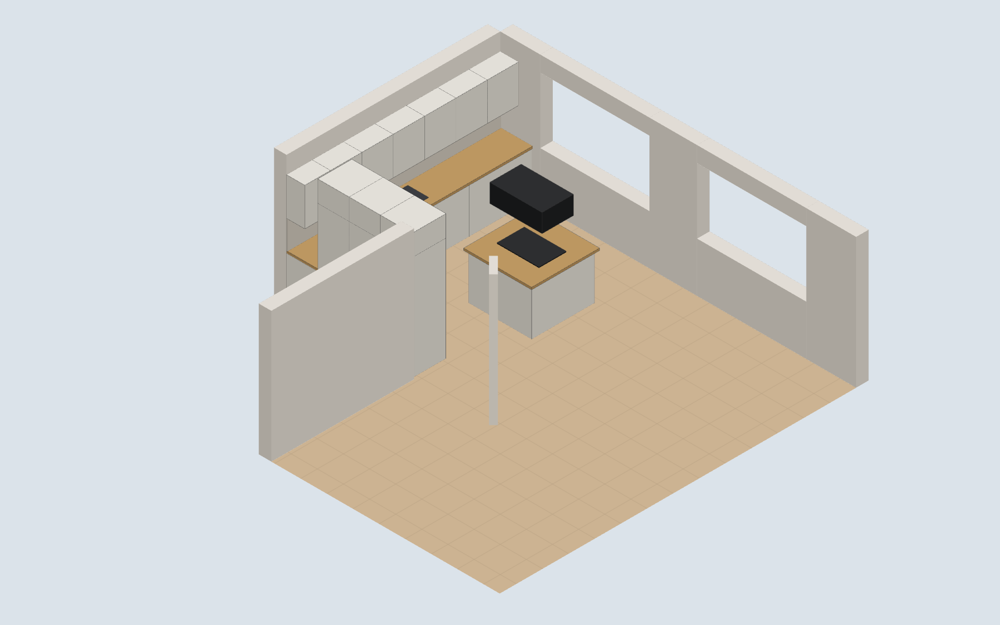
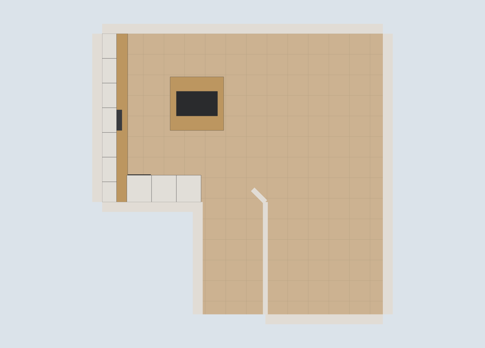
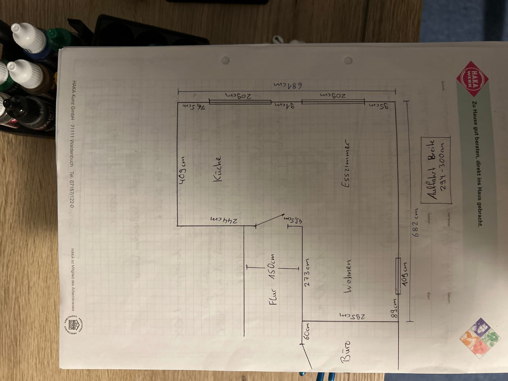
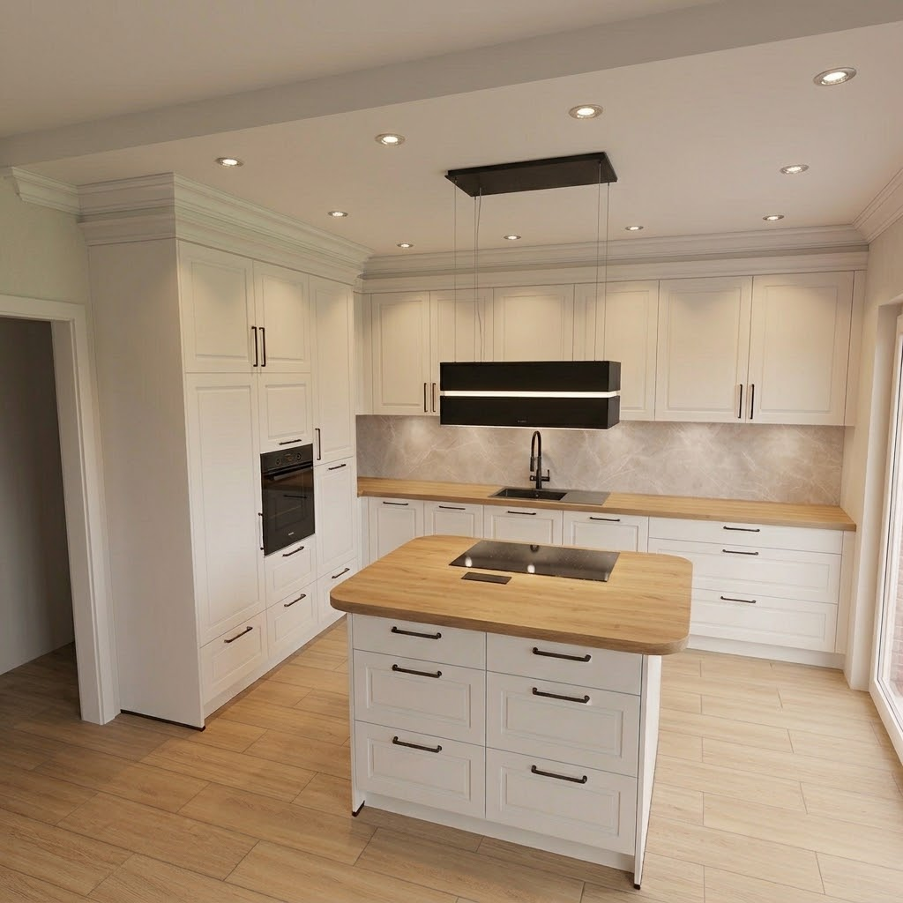

# Room Visualizer

WebXR-Raumplaner in TypeScript (Vite + Three.js). Entwickelt für die **Meta Quest 3**,
aber genauso im Desktop-Browser nutzbar – mit umschaltbarer **3D-**, **isometrischer**
und **2D-Grundriss-Ansicht**.

**Live:** https://baumgartner-software.github.io/room-visualizer/

## So sieht die Küche aktuell aus

Diese Bilder werden bei jedem Push automatisch aus der laufenden Anwendung
gerendert (siehe [Automatischer Screenshot](#automatischer-screenshot)) – sie
zeigen also immer den echten Stand des Projekts.



| Isometrisch | Grundriss (2D) |
| --- | --- |
|  |  |

## Ziel des Projekts

Einen Raum definieren, Einrichtungselemente aus einem Katalog hineinstellen und
diese direkt im Raum verschieben, drehen, einfärben und in der Größe anpassen –
am Ende immersiv mit der Quest 3 (VR oder AR/Passthrough), unterwegs aber auch
bequem am Desktop in 3D, isometrisch oder als 2D-Grundriss.

Erster Anwendungsfall ist die **Küchenplanung** im echten Grundriss des Hauses.

## Grundriss und Standard-Küche

Beim ersten Start (und über *Zurücksetzen*) lädt die Anwendung den Wohnbereich
aus der Bauplan-Skizze und eine fertig eingerichtete Küche.

| Bauplan (Handskizze) | Referenz-Rendering der Küche |
| --- | --- |
|  |  |

**Aus der Skizze übernommen** (Ursprung = nordwestliche Innenecke, x nach Osten,
z nach Süden; alle Maße in cm):

| Maß | Wert |
| --- | --- |
| Nordwand | 681 – aufgeteilt in 76,5 Wand · 209 Fenster · 91 Wand · 209 Fenster · 95 Wand |
| Ostwand | 682, mit Fenster 108 (89 vor der Südecke) |
| Küche | 409 (Westwand) × 244 (Südwand) |
| Flur | 152 breit, 273 lang, nach Süden offen (führt weiter zum Büro) |
| Südwand Wohnbereich | 285 |
| Wandscheibe am Flur | 43,5 diagonal |

**Angenommen** (in der Skizze nicht bemaßt): Raumhöhe 250 cm, Wandstärken
(außen 24, innen 12), Fensterbrüstung 95 cm und Fensteroberkante 220 cm. Der
Bereich hinter dem Flur (Büro) ist in der Skizze abgeschnitten und daher nicht
modelliert. Alles davon lässt sich in `src/defaultProject.ts` anpassen.

Die **Küche** folgt diesem Raster:

```
X x x x x x x     X/x  Unterschrank + Arbeitsplatte + Hängeschrank darüber
H 0 0 0 0 0       H/h  Hochschrank
H 0 0 K K 0       K    Kochinsel
h 0 0 K K 0       0    frei
0 0 0 0 0 0
```

Die durchgehende Zeile aus sieben Unterschränken (6 × 60 cm + 49 cm Passstück =
409 cm) mit Arbeitsplatte und Hängeschränken liegt an der **Westwand** – der
einzigen Wand der Küche ohne Fenster und damit der einzigen, an die
Hängeschränke passen. Die Spüle sitzt in der Mitte dieser Zeile.

Der Block aus drei Hochschränken (Herdumbau mit Backofen, Hochschrank,
Kühlschrank) steht quer dazu an der **Südwand** zum Flur. An der Nordwand wäre
er nicht möglich, dort sitzt das 209 cm breite Fenster – falls der Block dort
stehen soll, muss das Fenster anders liegen.

Die Kochinsel (120 × 120 cm) mit Kochfeld und Dunstabzugshaube steht frei im
Raum, mit rund 105 cm Gang zur Zeile und zum Hochschrankblock.

## Funktionen

- **Raum**: Grundriss als Polygon (auch L-Form) mit Fenstern, Türöffnungen und
  Innenwänden. Raumhöhe frei einstellbar, alternativ ein einfacher Rechteck-Raum.
- **Puppenhaus-Ansicht**: Wände zwischen Kamera und Raum werden ausgeblendet.
  Steht man im Raum (XR), bleiben alle Wände stehen.
- **Katalog** mit Küchenelementen im 60er-Raster (Unterschrank, Schubladen-,
  Spülen-, Herdumbauschrank, Hängeschrank, Aufsatzschrank, Hochschrank,
  Kühlschrank), Arbeitsplatte, Kochinsel, Kochfeld, Spülbecken, Backofen,
  Dunstabzugshaube und Rückwand.
- **Bearbeitungsmodus**: Am ausgewählten Element erscheinen sechs Griffkugeln
  (rot = X, grün = Y, blau = Z). Kugel ziehen = Größe der Seite ändern, Element
  ziehen = verschieben, dazu drehen, duplizieren, löschen.
- **Farbwerkzeug**: Farbe aus der Palette (oder eigene Farbe) wählen und
  Elemente, Wände oder den Boden per Klick einfärben – am Desktop und in VR.
- **Ansichten**: 3D (Orbit), isometrisch, 2D-Grundriss – jederzeit umschaltbar.
- **WebXR**: `immersive-vr` und `immersive-ar` (Passthrough auf der Quest 3).
  Controller-Trigger = auswählen/ziehen/malen, Griff-Taste = Menü vor sich holen.
  Das VR-Menü hat vier Seiten: Raum · Elemente · Farbe · Auswahl.
- **Persistenz** im Browser (localStorage), Export/Import als JSON.

### Bedienung

| | |
| --- | --- |
| Maus | Element anklicken = auswählen, ziehen = verschieben. Kugeln ziehen = Größe ändern. Rechte Maustaste = schwenken, Rad = Zoom. |
| Tastatur | `R` drehen · `Entf` löschen · `E` Griffe an/aus · `P` Pinsel an/aus · `Esc` abwählen |
| Quest 3 | „VR starten“ bzw. „AR (Passthrough)“, Trigger = auswählen/ziehen, Griff-Taste = Menü holen |

### URL-Parameter

| Parameter | Wirkung |
| --- | --- |
| `?ui=0` | Bedienoberfläche ausblenden |
| `?reset=1` | Gespeicherten Stand ignorieren, mit Grundriss + Standardküche starten |
| `?view=kitchen\|isometric\|top` | Startansicht wählen |
| `?cam=px,py,pz,tx,ty,tz` | Freie Kameraposition und Blickpunkt in Grundriss-Metern |

## Entwicklung

```bash
npm install
npm run dev         # http://localhost:5173
npm run build       # Typecheck + Produktions-Build nach dist/
npm run preview     # Build lokal ansehen
npm run screenshot  # Bilder in docs/preview/ neu rendern (benötigt Chromium)
```

Für `npm run screenshot` einmalig `npx playwright install chromium` ausführen.

Für Tests mit der Quest 3 muss die Seite über HTTPS erreichbar sein. Am
einfachsten ist die veröffentlichte GitHub-Pages-Seite; alternativ
`adb reverse tcp:5173 tcp:5173` mit dem Dev-Server (dann `http://localhost:5173`
im Quest-Browser, `localhost` gilt als sicherer Kontext).

### Projektstruktur

| Datei | Inhalt |
| --- | --- |
| `src/main.ts` | Einstieg: Renderer, Szene, Maus/Tastatur, Render-Loop, URL-Parameter |
| `src/defaultProject.ts` | Grundriss aus dem Bauplan + Standard-Küche |
| `src/store.ts` | Zustand (Raum + Elemente), Persistenz, Snapping/Clamping |
| `src/geometry.ts` | Grundriss-Mathematik (Bounding-Box, Schwerpunkt, Normalen) |
| `src/catalog.ts` | Element-Katalog |
| `src/room.ts` | Boden, Decke und Wände inklusive Fensteröffnungen |
| `src/elements.ts` | Meshes der platzierten Elemente |
| `src/editor.ts` | Auswahl, Verschieben, Griffkugeln, Farbwerkzeug – arbeitet mit Weltstrahlen und ist dadurch für Maus und XR-Controller identisch |
| `src/views.ts` | Kameras/Steuerung für 3D, isometrisch, 2D |
| `src/xr.ts` | WebXR-Session, Controller, Seitenmenü in VR/AR |
| `src/ui.ts` | HTML-Seitenpanel inklusive Farbpalette |
| `scripts/screenshot.mjs` | Headless-Rendering für die README-Bilder |

Alle Maße intern in **Metern**, die Oberfläche zeigt Zentimeter. Der
Raumursprung ist die nordwestliche Innenecke, `position` eines Elements ist die
Mitte seiner Unterkante.

## Deployment

Bei **jedem Push** baut `.github/workflows/deploy.yml` das Projekt (Typecheck +
Vite-Build). Pushes auf `main` werden zusätzlich auf **GitHub Pages**
veröffentlicht.

Voraussetzungen, die einmalig im Repository gesetzt werden müssen:

1. **Settings → Pages → Build and deployment → Source = „GitHub Actions“**
   ([Link](https://github.com/baumgartner-software/room-visualizer/settings/pages)).
   Der Actions-Token darf Pages nicht selbst aktivieren.
2. **Settings → Environments → `github-pages` → Deployment branches and tags**:
   `main` erlauben (oder „No restriction“)
   ([Link](https://github.com/baumgartner-software/room-visualizer/settings/environments)).

### Automatischer Screenshot

`.github/workflows/screenshot.yml` startet bei jedem Push auf `main` einen
Headless-Chromium, lädt die gebaute Anwendung mit `?reset=1&ui=0`, rendert die
drei Ansichten und committet die Bilder nach `docs/preview/` zurück auf `main`.
Der Commit trägt `[skip ci]` und löst deshalb keinen weiteren Lauf aus.

## Arbeitsweise / Hinweise für Agenten

- **Direkt auf `main` pushen ist erlaubt und erwünscht** – auch für KI-Agenten
  (z. B. Claude Code). Kein Pull-Request nötig, Build, Deploy und Screenshot
  laufen automatisch.
- Vor dem Push `npm run build` ausführen (Typecheck + Build müssen fehlerfrei sein).
- Änderungen am Funktionsumfang bitte in diesem README nachziehen.
- Die Bilder unter `docs/preview/` nicht von Hand bearbeiten – sie werden vom
  Workflow überschrieben.

## Roadmap / Ideen

- Hand-Tracking auf der Quest 3 (aktuell Controller)
- Elemente an Wänden und aneinander einrasten, Kollisionsprüfung
- Bemaßung im 2D-Grundriss, Grundriss im Editor bearbeiten
- Esszimmer und Wohnbereich möblieren, weitere Kataloge (Bad, Schlafzimmer)
- Realistischere Fronten (Griffe, Rahmen) und Materialien
